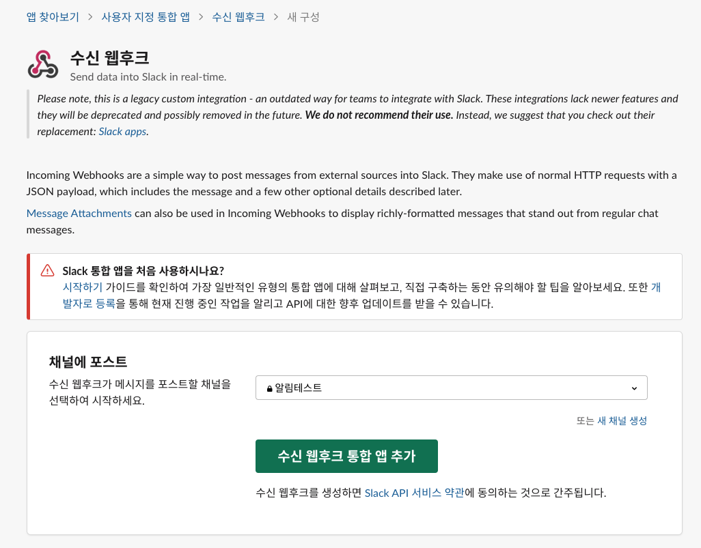

# SLACK 봇 알림 처리

> 생각보다 간단하게 curl을 통해서 app에 알림을 발송할 수 있는 API가 제공 되네요.

## 준비사항

1. Slack app (Incoming WebHooks) 설치
2. python3 설치

## 실행

### 환경 설정

```_env``` 의 이름을 ```.env```로 변경 후 API 주소와 채널정보를 입력합니다. 

```bash
# .env 파일 예시
SLACK_URL=https://hooks.slack.com/services/test/test/test
SLACK_CHANNEL="#알림테스트"
```

### 모듈 설치

python3에서 사용하는 모듈을 설치 합니다. 

```bash
$ pip install -r requirements.txt
```

### 실행 

```bash
$ python3 index.py
weekday
```

실행하면, 안내된 메시지를 확인 할 수 있습니다. 

아래는 메시지 결과 입니다. 


## slack app 설치 가이드


1. 알림을 수신 채널에서 화살표를 눌러서 상세 정보를 호출
2. ```통합``` 탭으로 이동
3. ```앱 추가``` 선택


```webhooks``` 검색 후 앱 설치 진행


Slack에 추가 진행



기본으로 발송될 채널을 선택합니다. 


설치 지침 및 API 정보가 보여지면 완료 되었습니다. 

페이지 내에 간단하게 CURL로 호출하는 예제도 포함되어 있습니다. 


